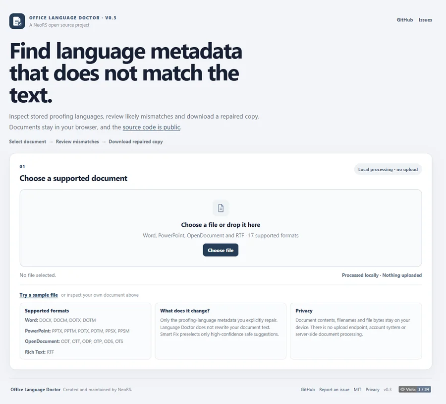

<p align="center">
  
</p>

<h1 align="center">Office Language Doctor</h1>

<p align="center">
  A NeoRS open-source browser tool for finding and repairing wrong proofing-language metadata in Word, PowerPoint, OpenDocument and RTF files.
</p>

<p align="center">
  <a href="https://nfreakz.github.io/office-language-doctor/">Live app</a>
  ·
  <a href="https://cecolab.cat/software/office-language-doctor/">Product page</a>
  ·
  <a href="https://github.com/Nfreakz/office-language-doctor">Source</a>
  ·
  <a href="https://github.com/Nfreakz/office-language-doctor/issues">Issues</a>
</p>

Office Language Doctor audits stored proofing-language metadata in Microsoft Office, OpenDocument and RTF files, compares it with the likely written language, and can repair selected mismatches.

Files are processed locally in the browser. There is no document upload, backend or account system.

<p align="center">
  <a href="https://nfreakz.github.io/office-language-doctor/">
    
  </a>
</p>

## Supported formats

17 formats are accepted for audit and repair.

| Family | Repairable formats | Validation state |
| --- | --- | --- |
| Microsoft Word OOXML | `.docx`, `.docm`, `.dotx`, `.dotm` | All listed variants opened correctly after repair in Microsoft Word; live VBA execution not yet tested |
| Microsoft PowerPoint OOXML | `.pptx`, `.pptm`, `.potx`, `.potm`, `.ppsx`, `.ppsm` | All listed variants opened correctly after repair in Microsoft PowerPoint; live VBA execution not yet tested |
| OpenDocument Text | `.odt`, `.ott` | ODT manually validated; OTT round-trip validated with LibreOffice 25.2.3.2 engine |
| OpenDocument Presentation | `.odp`, `.otp` | ODP manually validated; OTP round-trip validated with LibreOffice 25.2.3.2 engine |
| OpenDocument Spreadsheet | `.ods`, `.ots` | ODS manually validated; OTS round-trip validated with LibreOffice 25.2.3.2 engine, including formula preservation |
| Rich Text Format | `.rtf` | Automated scan/repair coverage plus manual Microsoft Word open/repair validation on the representative fixture |

Legacy binary formats `.doc`, `.ppt` and `.xls` are out of scope for the current browser-first architecture.

### XLSX

XLSX is not supported for proofing-language repair. SpreadsheetML rich-text runs do not expose the same per-text proofing-language field used by WordprocessingML and DrawingML.

A separate text-language audit may be considered later, but it would not be equivalent to metadata repair.

## Current status

Current version: **0.5.0 Community Edition**.

Version 0.5.0 is the initial public Community Edition baseline under MPL-2.0, with the complete browser-first feature set:

- expanded Word, PowerPoint and OpenDocument format variants;
- extension- and MIME-preserving repaired downloads;
- byte-for-byte `vbaProject.bin` preservation checks for DOCM and PPTM;
- calibrated Catalan, Valencian, Galician and Basque detection;
- conservative Smart Fix selection;
- human-readable fragment locations, including numbered ODP slides and exact ODS sheet + cell/range coordinates, plus stored-language source diagnostics;
- local CSV and JSON audit exports;
- initial RTF audit and repair support using `\\langN` and `\\deflangN`;
- the NeoRS public identity, document-check logo, favicon, source/issue/license links and local-processing guidance.

Macro-enabled fixtures used for manual compatibility tests did not contain live VBA. A repeatable live-VBA harness is now available, but the approved runner currently has no Word or PowerPoint installation, so live macro execution remains pending. OTT, OTP and OTS have now passed a real LibreOffice 25.2.3.2 headless engine round-trip; RTF has passed representative Microsoft Word open/repair validation.

## What it changes

Office Language Doctor changes only proofing-language metadata selected for repair. It does not rewrite the document text.

Smart Fix preselects only high-confidence non-Catalan/Valencian mismatches. Medium-confidence suggestions and Catalan/Valencian choices require explicit review.

## Capabilities

- reads stored proofing-language metadata;
- detects the likely written language locally;
- flags reliable mismatches;
- leaves short or ambiguous fragments unchanged;
- repairs selected fragments without changing their text;
- supports global remapping when mixed-language content is not detected;
- keeps Catalan and Valencian as an explicit user choice;
- shows a human-readable location for each fragment;
- shows whether stored language comes from direct text, paragraph defaults, styles or document defaults;
- downloads a repaired copy in the original format;
- exports the complete audit locally as CSV or JSON.

CSV export neutralizes leading spreadsheet-formula prefixes before download.

## Format notes

### Word

The audit covers the main document, headers, footers, footnotes, endnotes and comments.

Effective language is resolved from direct run metadata, character styles, paragraph properties/styles and document defaults. Fragment repair writes a direct `w:lang w:val` on the selected run.

DOCX has been validated in Microsoft Word with Catalan, Galician and Basque content. DOCM, DOTX and DOTM have also passed manual open/repair checks.

### PowerPoint

The audit covers slides, notes, charts and SmartArt data while excluding master/layout placeholder text from the user-facing audit.

PPTX has been validated with Catalan, Galician, Basque and mixed-language repairs. PPTM, POTX, POTM, PPSX and PPSM have also passed manual open/repair checks.

### RTF

RTF support reads character-language metadata from `\\langN` and document defaults from `\\deflangN`. Selected repair scopes the target LCID to the reviewed text run.

The parser handles normal body text, nested groups, Unicode `\\uN` escapes and Windows-1252 hex escapes. Embedded objects and complex destinations are excluded from the text audit.

A representative repaired RTF fixture has been manually validated in Microsoft Word: it opened without a repair/corruption warning, retained the expected text and accents, and re-scanned in Language Doctor with zero likely mismatches. Word's normal Protected View warning for files downloaded from the Internet is not considered a document-repair error.

### OpenDocument

ODT, ODP and ODS share one ODF engine. Language metadata is read from text, paragraph and spreadsheet cell styles.

For ODS, cell-style language can be inherited by cell text. Fragment repair writes a more specific text/paragraph style so formulas, numeric values and number formats remain unchanged.

ODP audit rows identify the numbered slide containing each fragment. ODS audit rows identify the sheet plus exact cell or range, for example `Sheet: Budget Q4 · AB1` or `Sheet: Sheet2 · B3:C4`; the same locations are included in local CSV/JSON audit exports. Coordinate resolution accounts for repeated rows/columns, self-closing empty cells, covered cells and merged ranges.

ODT, ODP and ODS have representative manual validation in LibreOffice Writer, Impress and Calc. OTT, OTP and OTS additionally passed a real LibreOffice 25.2.3.2 headless engine round-trip on 2026-10-02: text and template structure reopened correctly after an `en-US → ca-ES` language change, and OTS preserved `=SUM(B1:B2)` with result `42`. This is real LibreOffice-engine validation, not a visual GUI/manual inspection.

## Privacy

Document contents, filenames and file bytes stay on the user's device during analysis and repair.

The application has no document upload endpoint, backend database or account system.

The public visit counter is a simple external image request. It receives no document text, filenames or document bytes from the application.

## Development

```bash
npm install
npm run check:xml
npm run check:detector
npm run check:docx
npm run check:odf
npm run check:variants
npm run check:smart-fix
npm run check:diagnostics
npm run check:report
npm run check:rtf
npm run check:public-ui
npm run build
```

Local development:

```bash
npm run dev
```

## CI

Validation runs on the approved Windows self-hosted runner `DESKTOP-0NEP6ON`.

The public repository does not execute untrusted pull-request code on that machine.

## Roadmap

- run the live VBA preservation harness on a Windows self-hosted runner that has desktop Word and PowerPoint installed;
- optionally add a visual/manual GUI pass for OTT, OTP and OTS; real LibreOffice-engine round-trip validation is already complete;
- keep XLSX as a separate audit-only possibility.

## Contributing

The official Office Language Doctor repository currently does not accept external code contributions. Bug reports, compatibility findings and feature proposals are welcome through GitHub Issues.

Forking and modifying the source remains permitted under the project license.

## License

Office Language Doctor Community Edition is licensed under the Mozilla Public License 2.0 (`MPL-2.0`).

See [LICENSE](./LICENSE) and [docs/LICENSING.md](./docs/LICENSING.md) for the repository licensing policy.

Copyright © 2026 NeoRS.
